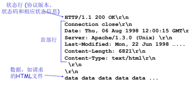

- 超文本传输协议，web的应用层协议。
- HTTP是一种无状态协议，每个HTTP请求都是独立的，服务器不会记录用户的信息或状态，这样可以更快的处理HTTP请求，并且没有状态维持，可以更快的建立缓存。但HTTP同样会需要状态维持服务，是通过cookie和会话状态管理来实现。
- ## 版本
	- ### HTTP1.0
	- ### HTTP1.1
	- ### HTTP2.0
- ## 报文格式
	- ### 请求报文
		- 
	- ### 响应报文
		- 
- ## 响应状态码
- ## Cookies
	- 一种小型文本文件，是由网站服务器存储在用户端系统中。当用户访问网站时，网站对应的cookie也会被跟随发送。
	- 使网站能够追踪用户的信息，提供更好的服务。
	-
- ## Web缓存
	- 由浏览器存储在用户端系统的内容副本。
	- ### 浏览器本地缓存
		- 浏览器会将网站内容存储在本地，当用户再次访问相同网站时，可以从本地加载网站内容。
	- ### 代理服务器缓存
		- 相比于浏览器本地缓存，代理服务器同样会将网站内容存储在自己的本地，但是允许多个用户访问。
	- ### CDN缓存
		- 相当于是代理服务器集群，分布在全球各地，由CDN服务提供商提供。