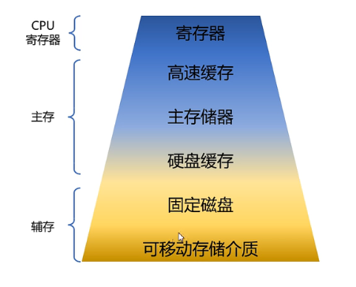

- ## 内存结构
	- 
- ## 内存连续分配
	- ### 固定分区分配
		- 将内存分为若干个固定大小的分区，每个分区只能分配给一个进程使用。该方法简单易行，但是会浪费内存资源，且不能有效地支持多进程并发执行。
	- ### 动态分区分配 + 空闲分区表
		- 在动态分区分配的基础上，系统会维护一张空闲分区表，记录当前可用的空闲分区信息，便于进行分配。该方法能够更有效地管理空闲分区，避免产生内存碎片，但是空闲分区表需要占用一定的内存空间。
	- ### 动态分区分配 + 伙伴算法
		- 伙伴算法是一种分配内存空间的动态管理方法，它采用一种“树状结构”组织空闲内存块，并且每个内存块的大小是2的幂次方。伙伴算法能够更好地管理内存空间，并且分配效率高，但是也需要进行空闲块合并等操作。
- ## 内存非连续分配
	- ### 分页存储管理
		- 将进程的地址空间分为固定大小的页，每一页都对应物理内存中的某个位置，可以充分利用内存空间，支持虚拟内存技术。
	- ### 段式存储管理
		- 将进程的地址空间划分为大小可变的段，每个段依据功能分为代码段、数据段、堆栈段等，每个段还可以有独立的访问权限和保护机制。例如，代码段可能被标记为只读，以避免程序中的错误修改代码。
	- ### 段页式存储管理
		- 是段式存储管理和分页存储管理的结合，将进程的地址空间划分为多个段，每个段再按页划分，每一页被映射到物理内存中的某个位置，同时每个段可以单独分配和保护，进一步提高了进程的灵活性和安全性。
- ## 虚拟内存