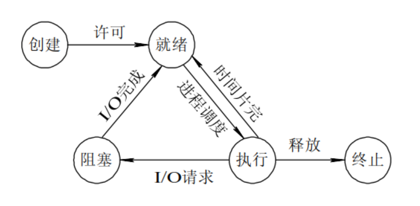

- ## 进程/线程
	- ### 定义
		- 进程是资源分配的最小单位，线程是CPU调度的最小单位。
	- ### 地址空间
		- 进程之间是独立的地址空间，而线程共享本进程的地址空间。
	- ### 执行过程
		- 每个独立的进程有一个程序运行的入口，执行开销大。但是线程不能独立执行，必须依存在应用程序中，由应用程序提供多个线程执行控制，执行开销小。
	- ### 切换时
		- 进程切换时，消耗的资源大，线程有自己独立的程序计数器和数据空间，开销小。
	- ### 存活
		- 一个进程崩溃后，在保护模式下不会对其他进程产生影响，但是一个线程崩溃整个进程都死掉。
- ## 进程结构
	- ### 控制段PCB
		- 进程唯一标识
	- ### 数据段
		- 进程运行时使用的数据区域
	- ### 程序段
		- 进程执行的代码部分
- ## 进程状态
	- 
	-
- ## 进程控制
	- 
	- 通过[[原语]]进行进程控制
	- CPU
- ## 线程结构
	- ### 控制段TCB
		- 线程唯一标识
	- ### 线程相关资源
	- ### 线程栈
		- 线程执行任务时使用的栈空间
- ## 线程类型
	- ### 用户级线程
		- 由用户空间的线程库实现的，通过线程库本身的功能实现线程创建，销毁，切换，开销小。
		- 但是由于无法利用系统CPU资源，只可以占用一部分内存资源，所以无法实现[[多线程协同]]工作。
		- 一个用户级线程一旦发生阻塞，整个进程也会阻塞，因为用户级线程阻塞无法切换
	- ### 内核级线程
		- 由操作系统内核实现的，通过内核完成线程创建，撤销，切换，开销比用户级线程大。
		- 可以利用系统资源，支持多线程协同工作。
		- 内核级线程发生阻塞，操作系统会将该线程的状态设置为阻塞状态，并将CPU资源分配给其他可以运行的线程。进行抢占式线程切换。
- ## 死锁
	- 死锁是指两个或两个以上的进程在执行过程中，由于竞争资源或者由于彼此通信而造成的一种阻塞的现象。
	- ### 死锁条件
		- #### 互斥条件
			- 一个资源每次只能被一个进程使用。
		- #### 请求与保持条件
			- 进程已经持有了至少一个资源，但又提出了新的资源请求时，该请求的资源已被其他进程占有，此时请求进程被阻塞，并对自己已获得的资源保持不放。
		- #### 不可剥夺条件
			- 进程所获得的资源在未使用完毕之前，不能被其他进程强行夺走，即只能由获得该资源的进程自己来释放（只能是主动释放)。
		- #### 循环等待条件
			- 若干进程间形成首尾相接循环等待资源的关系。
	- ### 避免死锁
		- 阻止进程在持有资源的同时申请其它资源
		- 允许对资源实行抢夺。
		- 对系统所有资源进行线性排序并赋予不同的序号，这样我们便可以规定进程在申请资源时必须按照序号递增的顺序进行资源的申请，当以后要申请时需检查要申请的资源的编号大于当前编号时，才能进行申请。